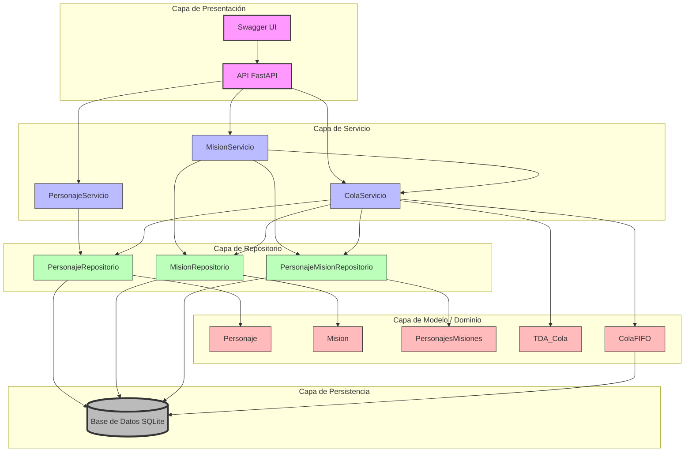
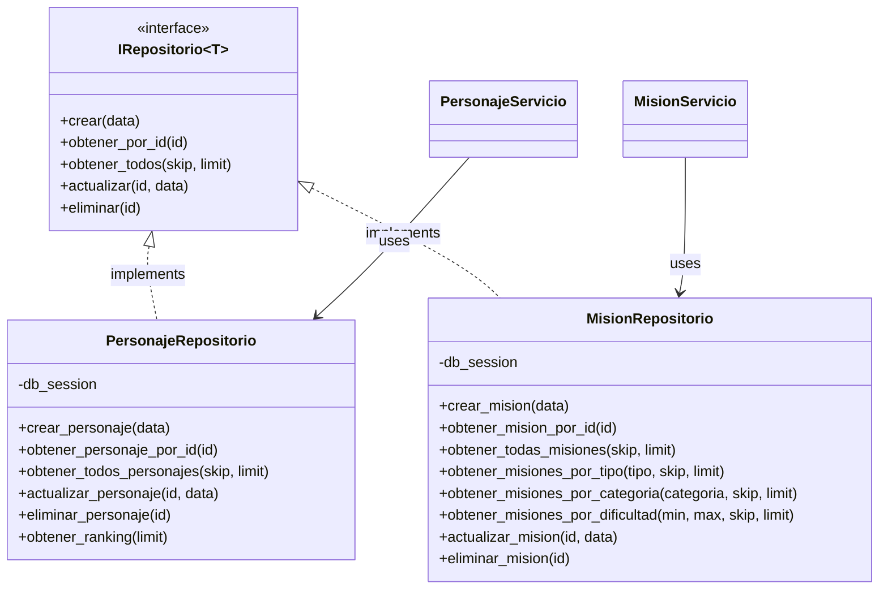
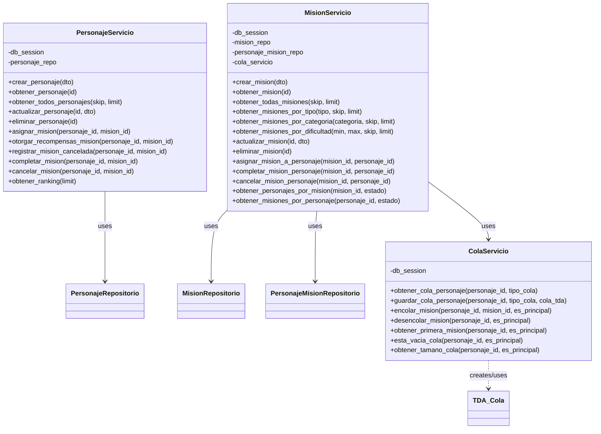
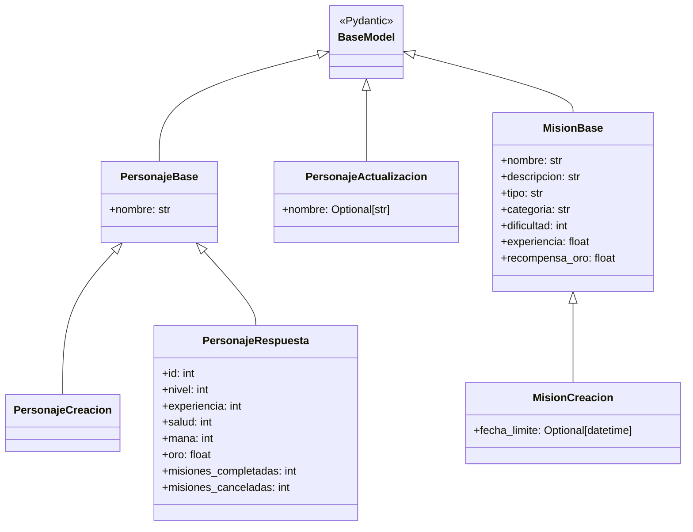
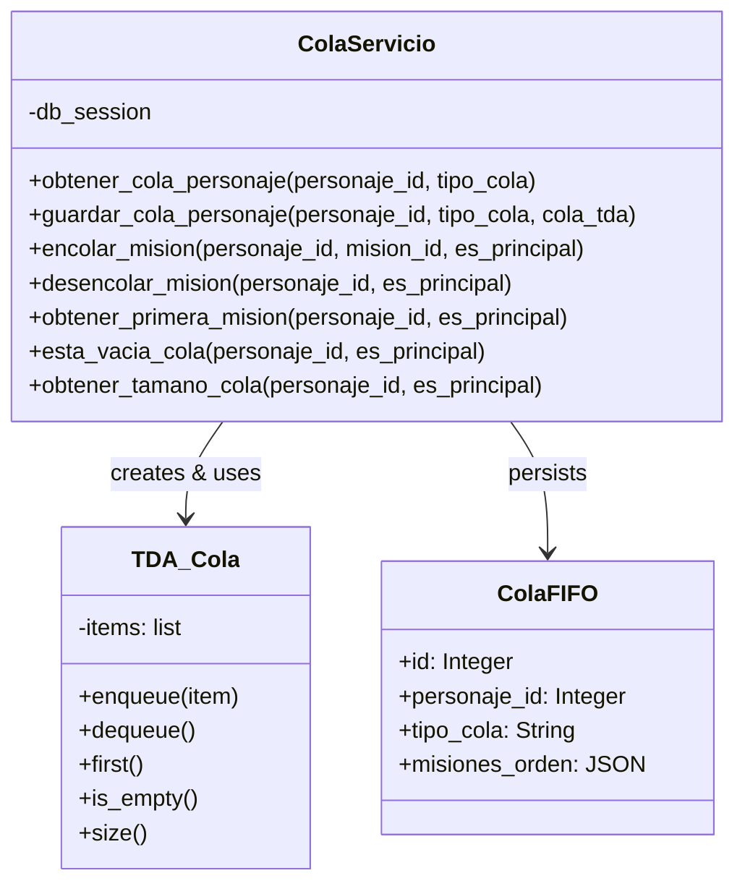
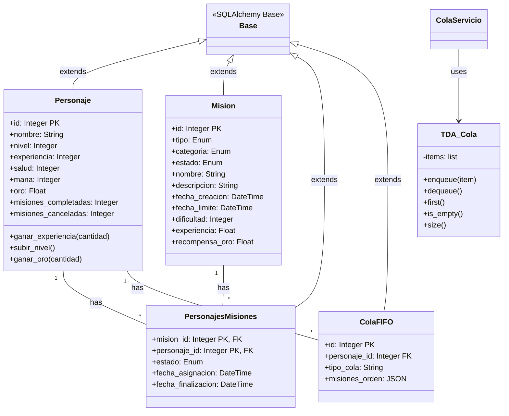
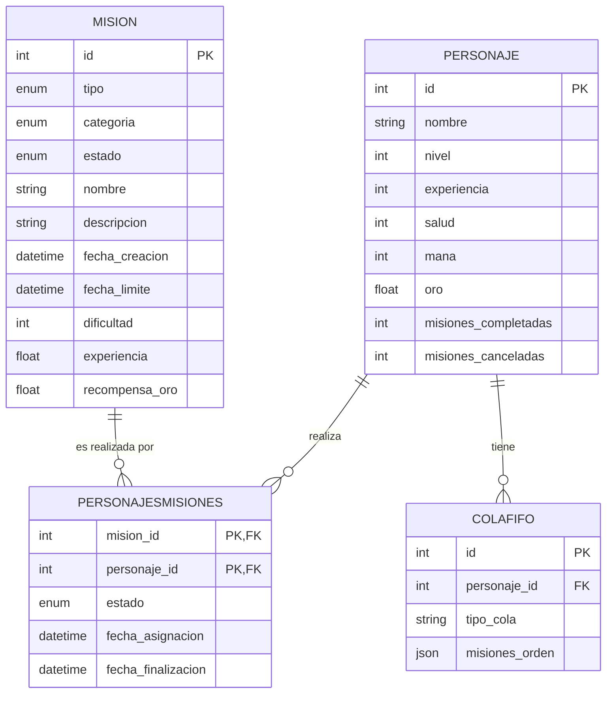
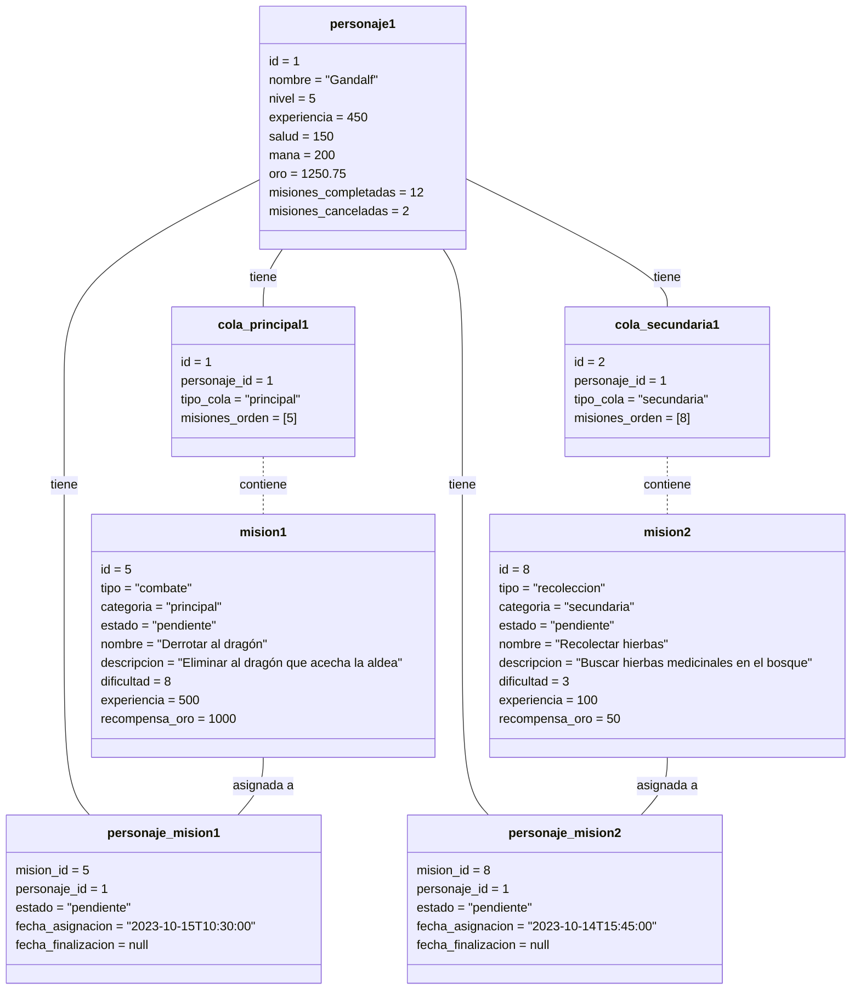
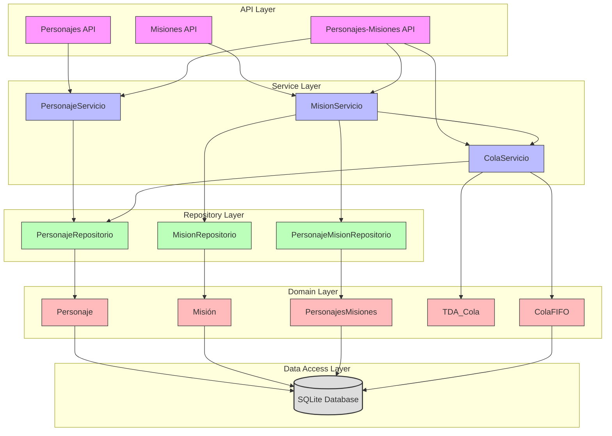

# Diagramas del Sistema RPG

Este documento contiene todos los diagramas principales del sistema RPG, incluyendo arquitectura, patrones, clases, entidad-relación, objetos y componentes.

## Índice
1. [Diagrama de Arquitectura](#1-diagrama-de-arquitectura)
2. [Diagramas de Patrones](#2-diagramas-de-patrones)
3. [Diagrama de Clases](#3-diagrama-de-clases)
4. [Modelo Entidad-Relación](#4-modelo-entidad-relación)
5. [Diagrama de Objetos](#5-diagrama-de-objetos)
6. [Diagrama de Componentes](#6-diagrama-de-componentes)

---

## 1. Diagrama de Arquitectura

Este diagrama muestra la arquitectura en capas del sistema RPG, ilustrando la separación clara de responsabilidades y la dirección del flujo de datos.

El diagrama muestra nuestro sistema con una arquitectura en capas bien definida:
1. **Capa de Presentación**: API REST con FastAPI y documentación Swagger
2. **Capa de Servicio**: Implementa la lógica de negocio
3. **Capa de Repositorio**: Abstrae el acceso a datos
4. **Capa de Modelo/Dominio**: Define las entidades del sistema
5. **Capa de Persistencia**: Almacenamiento en base de datos SQLite

---

## 2. Diagramas de Patrones

### 2.1 Patrón Repositorio

### 2.2 Patrón Servicio

### 2.3 Patrón DTO (Data Transfer Object)

### 2.4 Patrón TDA (Tipo de Dato Abstracto)

---

## 3. Diagrama de Clases

---

## 4. Modelo Entidad-Relación

---

## 5. Diagrama de Objetos

Este diagrama muestra un ejemplo de instancias concretas de las clases del sistema y sus relaciones.

---

## 6. Diagrama de Componentes

El diagrama de componentes muestra la estructura a alto nivel del sistema, ilustrando cómo están organizados los diferentes módulos y sus dependencias entre sí. Podemos observar la clara separación en capas, donde cada componente tiene una responsabilidad bien definida y depende únicamente de los componentes de su misma capa o capas inferiores.
