# Diagramas de Secuencia - Sistema RPG de Misiones

Este documento presenta los diagramas de secuencia para los principales casos de uso del sistema RPG, mostrando la interacción entre componentes.

**Total de Casos de Uso Documentados: 27**

## Índice
- [1. Gestión de Personajes](#1-gestión-de-personajes)
- [2. Gestión de Misiones](#2-gestión-de-misiones)
- [3. Gestión de Asignación y Progreso](#3-gestión-de-asignación-y-progreso)
- [4. Gestión de Colas de Misiones](#4-gestión-de-colas-de-misiones)
- [5. Consultas y Reportes](#5-consultas-y-reportes)
- [6. Administración del Sistema](#6-administración-del-sistema)

---

## 1. Gestión de Personajes

### 1.1 CU-P01: Crear Personaje

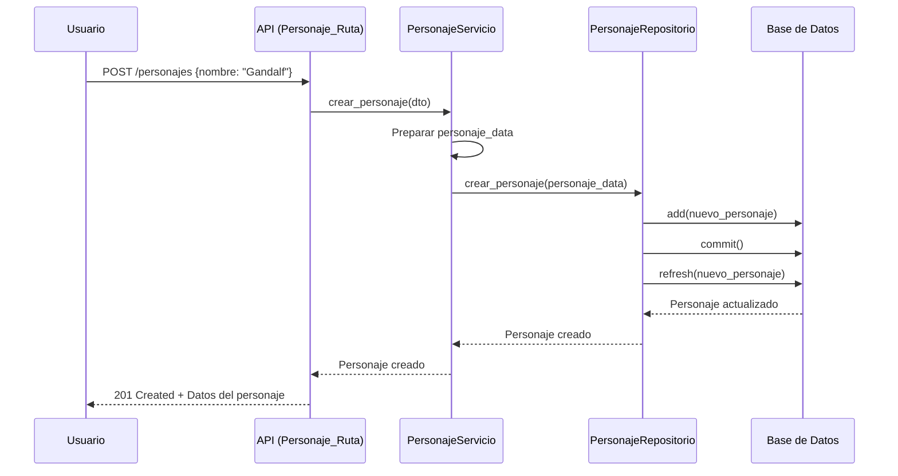

### 1.2 CU-P02: Obtener Personaje

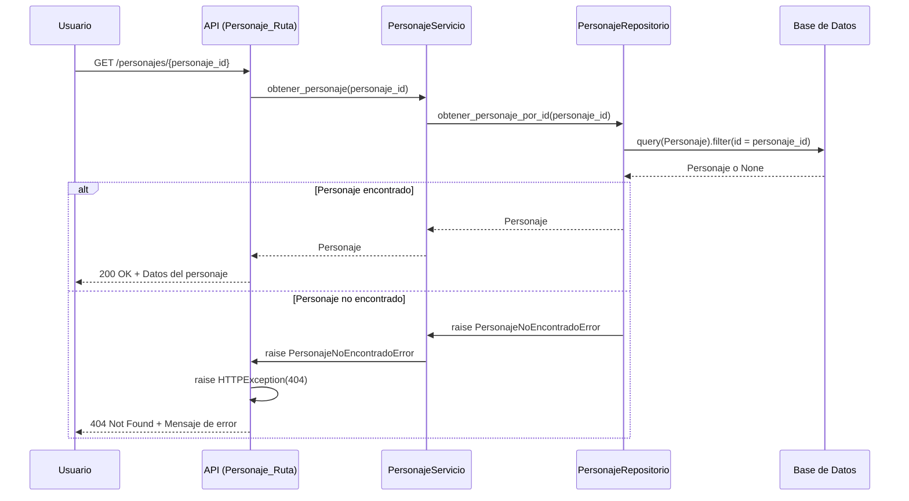

### 1.3 CU-P03: Listar Personajes

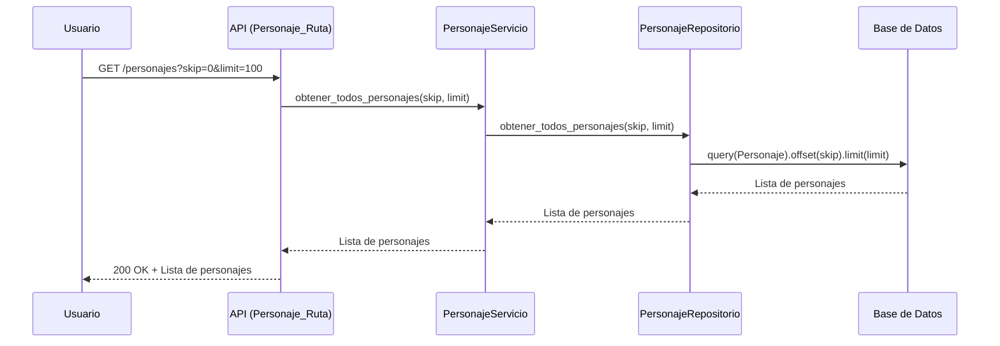

### 1.4 CU-P04: Actualizar Personaje

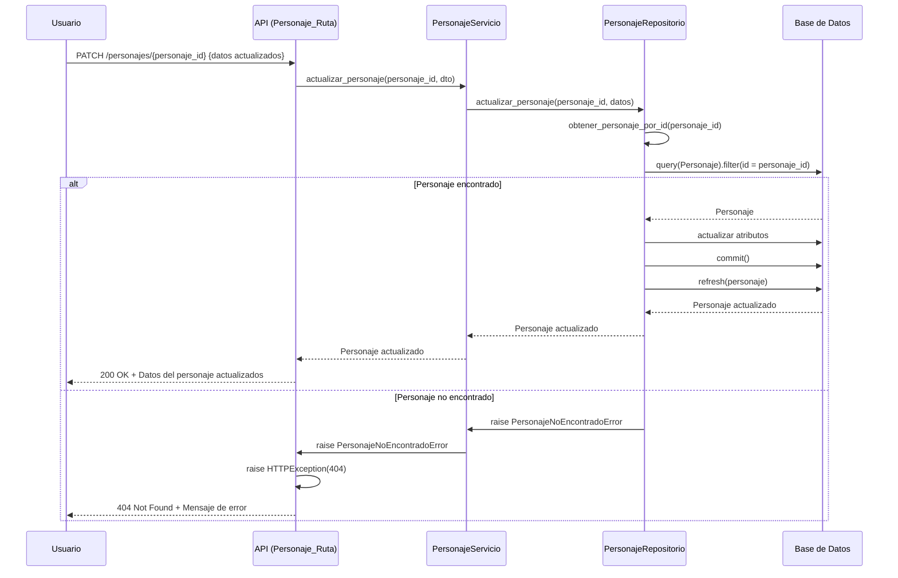

### 1.5 CU-P05: Eliminar Personaje

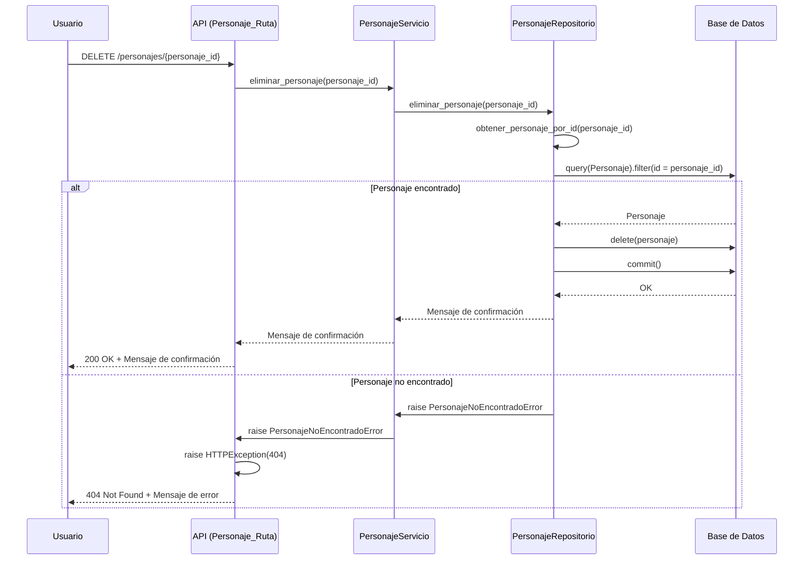

### 1.6 CU-P06: Consultar Ranking de Personajes

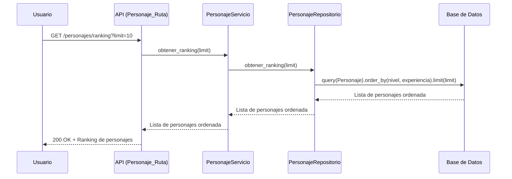

## 2. Gestión de Misiones

### 2.1 CU-M01: Crear Misión

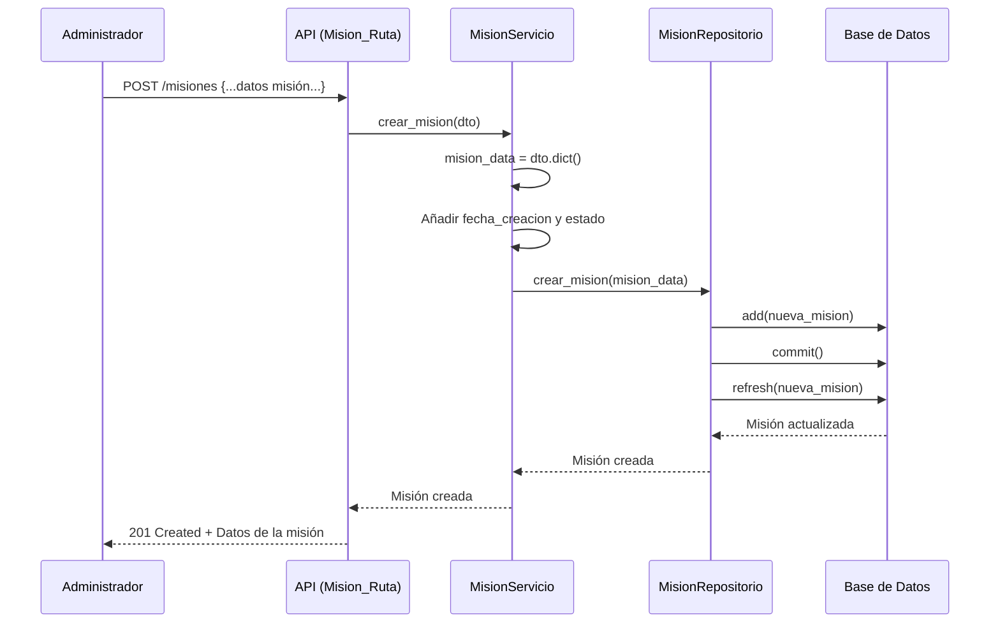

### 2.2 CU-M02: Obtener Misión

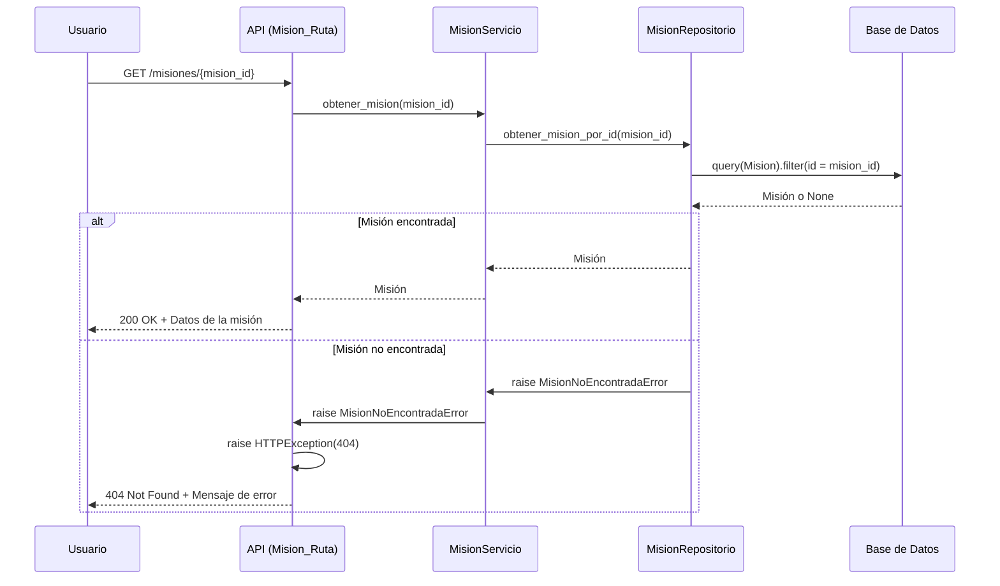

### 2.3 CU-M03: Listar Misiones

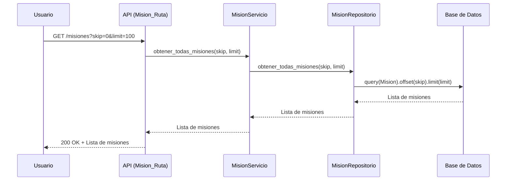

### 2.4 CU-M04: Filtrar Misiones por Tipo

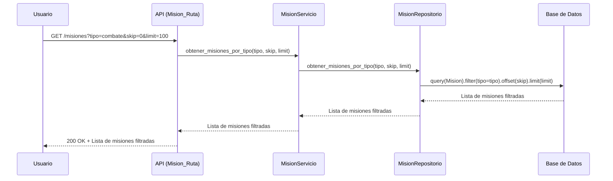

### 2.5 CU-M05: Filtrar Misiones por Categoría

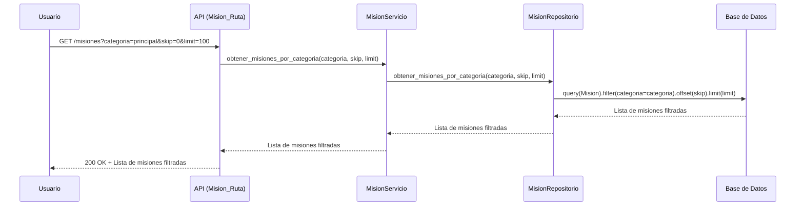

### 2.6 CU-M06: Filtrar Misiones por Dificultad

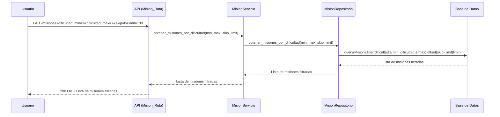

### 2.7 CU-M07: Actualizar Misión

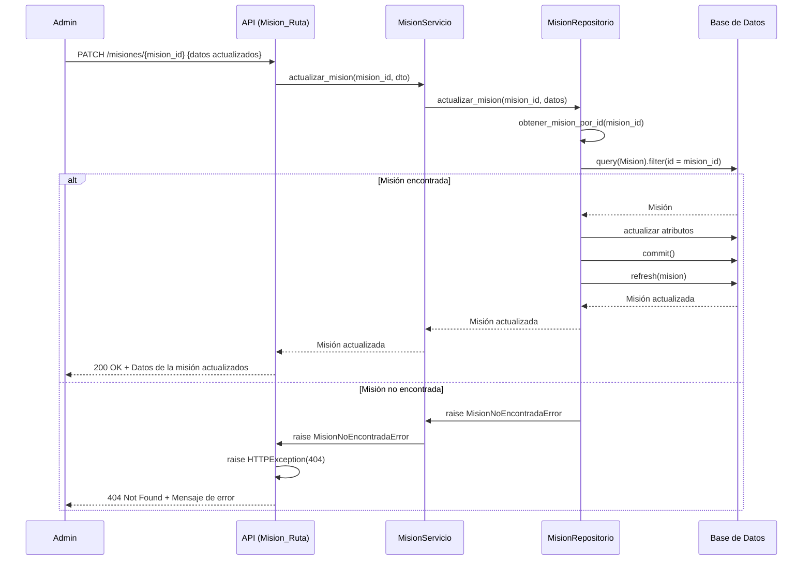

### 2.8 CU-M08: Eliminar Misión

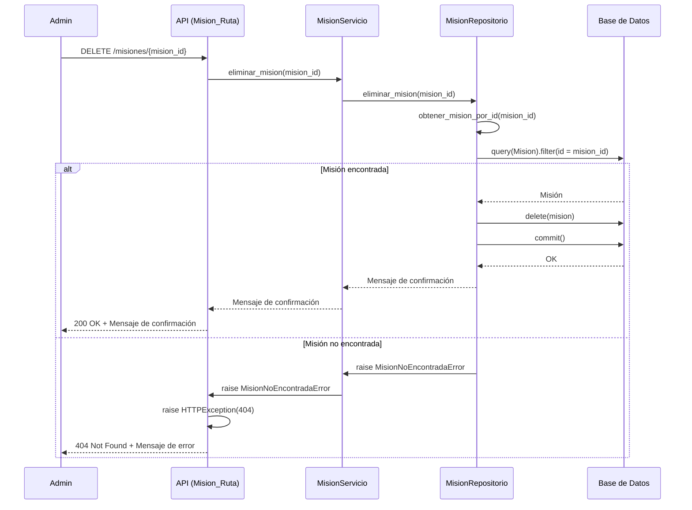

## 3. Gestión de Asignación y Progreso

### 3.1 CU-A01: Asignar Misión a Personaje

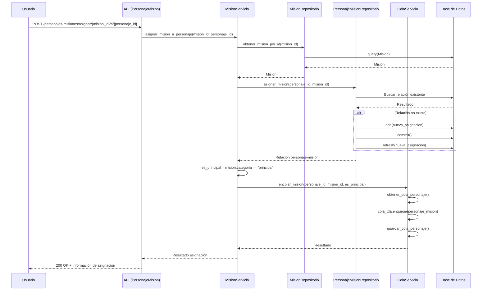

### 3.2 CU-A02: Completar Misión

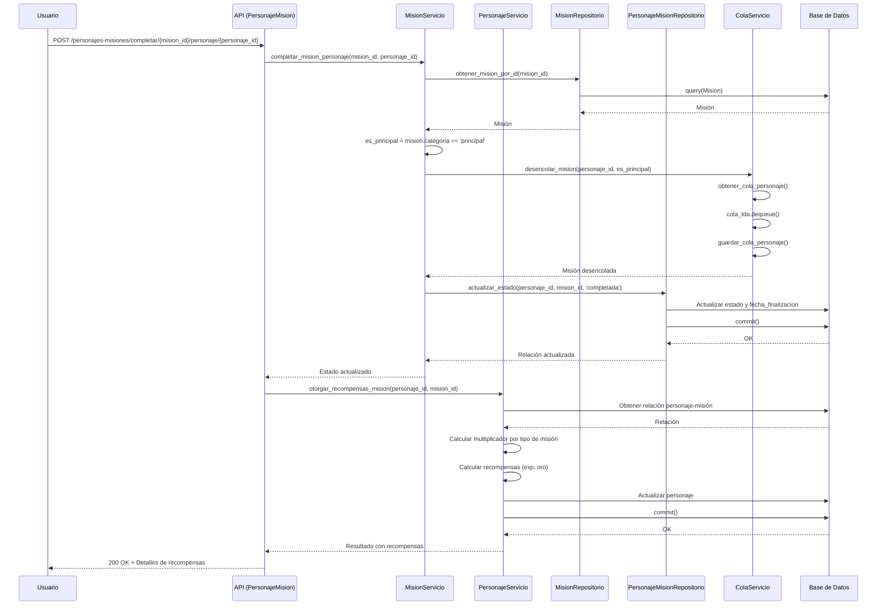

### 3.3 CU-A03: Completar Primera Misión en Cola

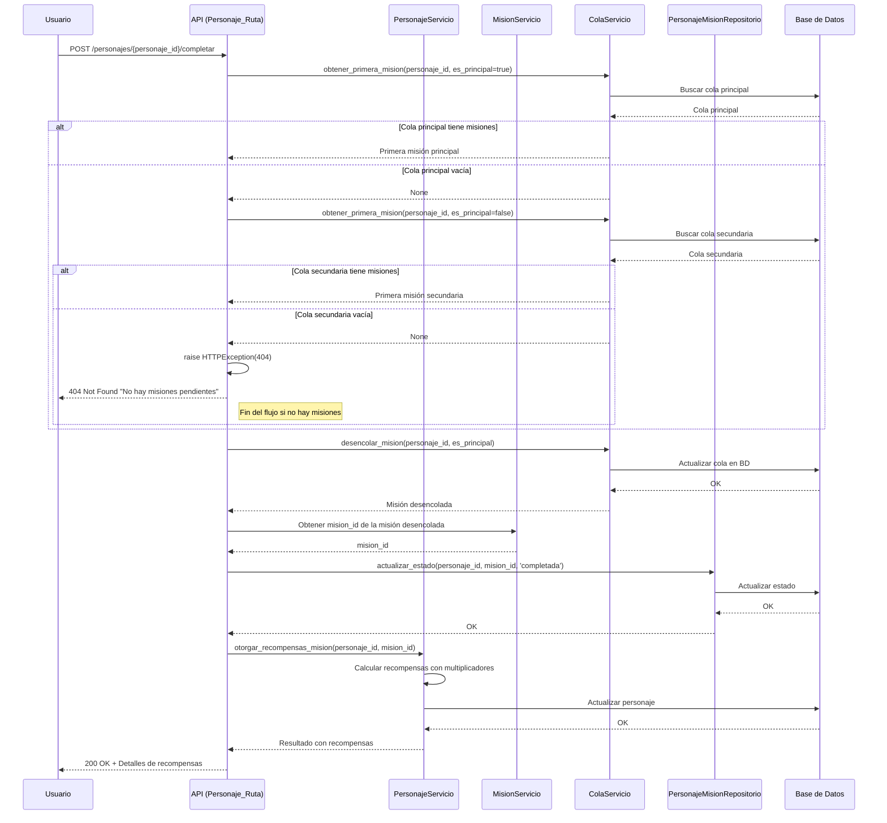

### 3.4 CU-A04: Cancelar Misión

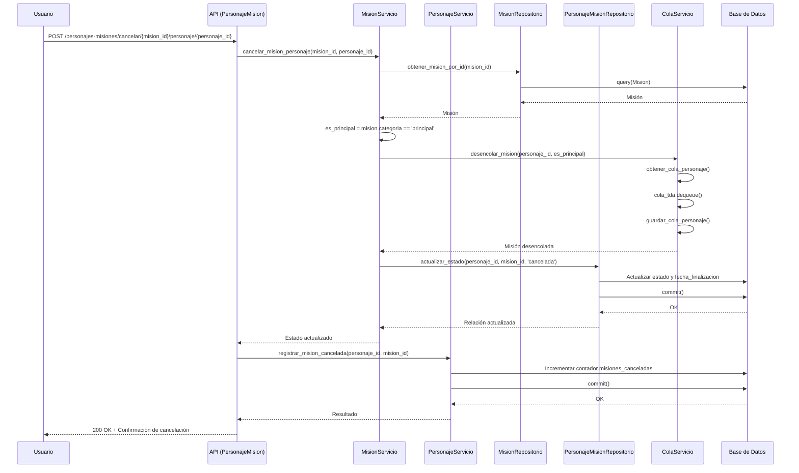

### 3.5 CU-A05: Listar Misiones de Personaje

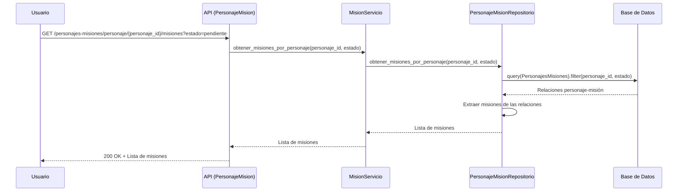

### 3.6 CU-A06: Listar Personajes por Misión

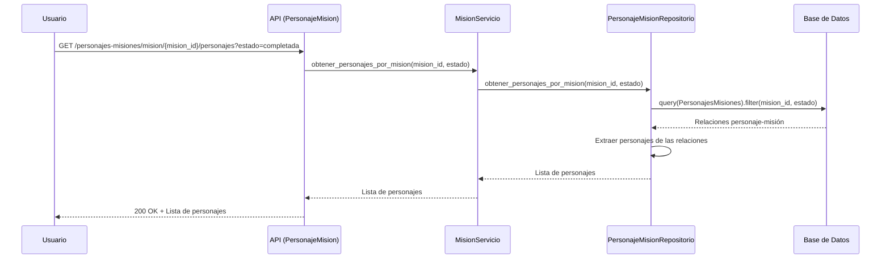

## 4. Gestión de Colas de Misiones

### 4.1 CU-C01: Consultar Cola de Misiones

```mermaid
sequenceDiagram
    participant Usuario
    participant API as API (PersonajeMision)
    participant ColaServ as ColaServicio
    participant BD as Base de Datos

    Usuario->>API: GET /personajes-misiones/personaje/{personaje_id}/cola/{tipo_cola}
    API->>API: Validar tipo_cola ('principal' o 'secundaria')
    API->>ColaServ: esta_vacia_cola(personaje_id, es_principal)
    ColaServ->>ColaServ: obtener_cola_personaje()
    ColaServ->>BD: query(ColaFIFO)
    BD-->>ColaServ: Datos de cola
    ColaServ-->>API: ¿Cola vacía?
    
    API->>ColaServ: obtener_tamano_cola(personaje_id, es_principal)
    ColaServ->>ColaServ: obtener_cola_personaje()
    ColaServ-->>API: Tamaño de cola
    
    API->>ColaServ: obtener_primera_mision(personaje_id, es_principal)
    ColaServ->>ColaServ: obtener_cola_personaje()
    ColaServ->>ColaServ: cola_tda.first()
    ColaServ-->>API: Primera misión (o null)
    
    API->>API: Preparar respuesta con la información
    API-->>Usuario: 200 OK + Información de la cola
```

### 4.2 CU-C02: Obtener Misiones en Orden FIFO

```mermaid
sequenceDiagram
    participant Usuario
    participant API as API (Personaje_Ruta)
    participant ColaServ as ColaServicio
    participant BD as Base de Datos

    Usuario->>API: GET /personajes/{personaje_id}/misiones
    API->>ColaServ: obtener_cola_personaje(personaje_id, 'principal')
    ColaServ->>BD: query(ColaFIFO).filter(personaje_id, tipo='principal')
    BD-->>ColaServ: Cola principal
    ColaServ-->>API: Cola principal (TDA_Cola)
    
    API->>ColaServ: obtener_cola_personaje(personaje_id, 'secundaria')
    ColaServ->>BD: query(ColaFIFO).filter(personaje_id, tipo='secundaria')
    BD-->>ColaServ: Cola secundaria
    ColaServ-->>API: Cola secundaria (TDA_Cola)
    
    API->>API: Extraer misiones de ambas colas
    API->>API: Combinar listas (principales seguidas de secundarias)
    API-->>Usuario: 200 OK + Lista ordenada de misiones
```

## 5. Consultas y Reportes

### 5.1 CU-R01: Obtener Estadísticas de Personaje

```mermaid
sequenceDiagram
    participant Usuario
    participant API as API (Personaje_Ruta)
    participant PServ as PersonajeServicio
    participant PRepo as PersonajeRepositorio
    participant BD as Base de Datos

    Usuario->>API: GET /personajes/{personaje_id}
    API->>PServ: obtener_personaje(personaje_id)
    PServ->>PRepo: obtener_personaje_por_id(personaje_id)
    PRepo->>BD: query(Personaje).filter(id = personaje_id)
    BD-->>PRepo: Personaje o None
    
    alt Personaje encontrado
        PRepo-->>PServ: Personaje con estadísticas
        PServ-->>API: Personaje con estadísticas
        API-->>Usuario: 200 OK + Estadísticas completas
    else Personaje no encontrado
        PRepo->>PServ: raise PersonajeNoEncontradoError
        PServ->>API: raise PersonajeNoEncontradoError
        API->>API: raise HTTPException(404)
        API-->>Usuario: 404 Not Found + Mensaje de error
    end
```

### 5.2 CU-R02: Obtener Historial de Misiones

```mermaid
sequenceDiagram
    participant Usuario
    participant API as API (PersonajeMision)
    participant MServ as MisionServicio
    participant PMRepo as PersonajeMisionRepositorio
    participant BD as Base de Datos

    Usuario->>API: GET /personajes-misiones/personaje/{personaje_id}/misiones
    API->>MServ: obtener_misiones_por_personaje(personaje_id)
    MServ->>PMRepo: obtener_misiones_por_personaje(personaje_id)
    PMRepo->>BD: query(PersonajesMisiones).filter(personaje_id)
    BD-->>PMRepo: Todas las relaciones personaje-misión
    PMRepo->>PMRepo: Extraer misiones con estado y fechas
    PMRepo-->>MServ: Historial completo de misiones
    MServ-->>API: Historial completo de misiones
    API-->>Usuario: 200 OK + Historial de misiones
```

### 5.3 CU-R03: Consultar Recompensas Potenciales

```mermaid
sequenceDiagram
    participant Usuario
    participant API as API (Mision_Ruta)
    participant MServ as MisionServicio
    participant MRepo as MisionRepositorio
    participant BD as Base de Datos

    Usuario->>API: GET /misiones/{mision_id}
    API->>MServ: obtener_mision(mision_id)
    MServ->>MRepo: obtener_mision_por_id(mision_id)
    MRepo->>BD: query(Mision).filter(id = mision_id)
    BD-->>MRepo: Misión o None
    
    alt Misión encontrada
        MRepo-->>MServ: Misión con recompensas base
        MServ-->>API: Misión con recompensas base
        API-->>Usuario: 200 OK + Datos de misión con recompensas
    else Misión no encontrada
        MRepo->>MServ: raise MisionNoEncontradaError
        MServ->>API: raise MisionNoEncontradaError
        API->>API: raise HTTPException(404)
        API-->>Usuario: 404 Not Found + Mensaje de error
    end
```

## 6. Administración del Sistema

### 6.1 CU-S01: Inicialización del Sistema

```mermaid
sequenceDiagram
    participant Sistema
    participant App as FastAPI App
    participant BD as Base de Datos

    Sistema->>App: Iniciar aplicación
    App->>App: Evento "startup"
    App->>BD: crear_tablas()
    BD->>BD: Verificar existencia de tablas
    
    alt Tablas no existen
        BD->>BD: Base.metadata.create_all()
        BD-->>App: Tablas creadas
    else Tablas ya existen
        BD-->>App: Tablas existentes verificadas
    end
    
    App->>App: Registrar routers
    App-->>Sistema: Aplicación iniciada y lista
```

### 6.2 CU-S02: Consultar Documentación API

```mermaid
sequenceDiagram
    participant Dev as Desarrollador
    participant API as API (Docs)
    participant App as FastAPI App

    Dev->>API: GET /docs
    API->>App: get_swagger_ui_html()
    App->>App: Generar esquema OpenAPI
    App->>App: Renderizar interfaz Swagger UI
    App-->>API: HTML + JS de Swagger UI
    API-->>Dev: Documentación interactiva de la API
```

---

Los diagramas de secuencia presentados muestran cómo interactúan los diferentes componentes del sistema para implementar los casos de uso del RPG, siguiendo la arquitectura por capas establecida (API → Servicio → Repositorio → Base de Datos) y respetando los principios de separación de responsabilidades.
